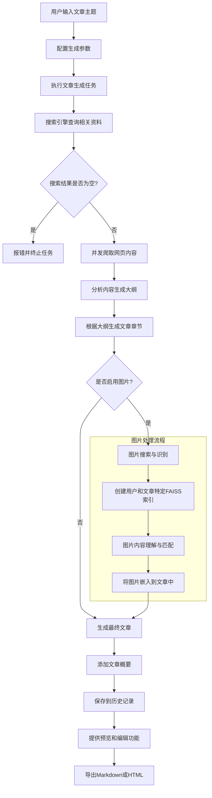
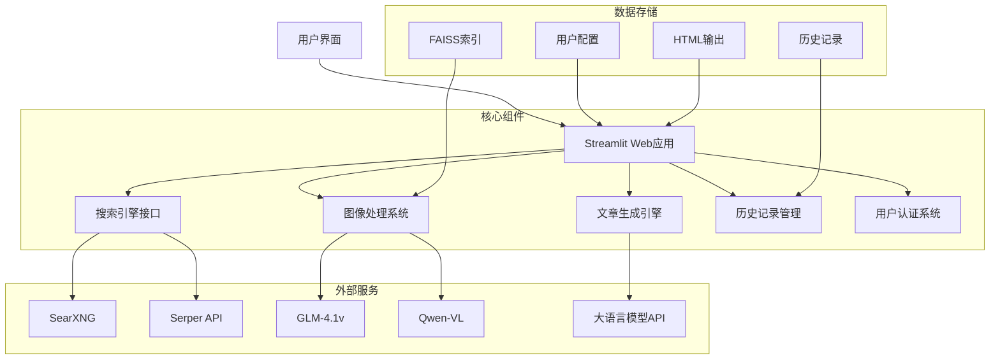

# 超级写手 (SupaWriter)

**超级写手** 是一个集成了大模型、搜索引擎和多模态技术的智能写作平台，旨在通过自动化手段提升内容创作效率和质量。它不仅是一个文本生成工具，更是一个涵盖资料收集、信息整理、内容创作和多平台发布的全流程创作系统。

## 📋 功能概述

### 核心功能

1. **智能内容创作**
   - 基于多个搜索引擎自动查询并整合互联网资料
   - **双引擎搜索**：集成 SearXNG + Serper API，提供更全面的搜索覆盖
   - 智能分析和提取关键信息，构建文章框架
   - 根据用户需求生成定制化高质量内容
   - 支持多种写作风格和内容类型
   - 自动生成文章概要，提供整体内容预览

2. **多模态内容处理**
   - 智能图像识别和处理，自动为文章匹配相关图片
   - 图像内容理解和描述，增强文章可视化效果
   - 用户和文章特定的FAISS索引，确保图片数据隔离和准确匹配
   - 支持直接使用图片URL，无需本地存储
   - **防盗链优化**：智能处理 CSDN、知乎、阿里云等主流网站的图片防盗链，确保图片下载成功率

3. **内容创作导航中心**
   - 集成多种搜索引擎：SearXNG、秘塔AI搜索、Google等
   - 连接主流内容发布平台：微信公众号、头条号、百家号等
   - 提供AI视频创作工具链接：即梦、剪映等视频创作平台
   - 本地Markdown编辑器和内容管理工具

4. **用户系统与历史记录**
   - 多用户支持，数据隔离
   - 创作历史记录和数据分析
   - 个性化设置和偏好保存
   - 统一的HTML预览和下载界面

## 🔧 技术特点

1. **多引擎搜索系统**
   - **SearXNG**：隐私保护的元搜索引擎，聚合多个搜索源
   - **Serper API**：Google 搜索 API，提供高质量的搜索结果
   - 自动合并和去重搜索结果，提供更全面的信息覆盖
   - 智能关键词优化，提高搜索相关性

2. **高效并发网页抽取**
   - 基于Playwright的异步网页内容获取
   - 可配置的并发爬虫数量（默认20个）
   - 智能超时处理和错误重试机制
   - 批次内URL去重，避免重复内容

3. **智能图像处理系统**
   - 支持多种VL模型：GLM-4.1v和Qwen-VL系列
   - 图像URL规范化和去重处理
   - 基于FAISS的图像相似度检索
   - 支持直接图片URL嵌入或多模态处理
   - **多网站防盗链支持**：
     - CSDN、知乎、简书、掘金
     - 微信公众号、阿里云 OSS/CDN
     - 51CTO、InfoQ、SegmentFault
     - 智能 Referer 选择和多策略重试机制

4. **用户和文章特定的数据隔离**
   - 每篇文章独立的FAISS索引
   - 基于用户名和文章ID的索引路径结构：`/data/faiss/{username}/{article_id}/`
   - 自动索引加载和回退机制
   - 多用户环境下的数据安全隔离

5. **可靠的错误处理**
   - 搜索结果为空的错误处理和提示
   - 网络请求超时保护
   - 详细的日志记录和状态追踪
   - 任务状态实时更新

## 💯 应用场景

1. **自媒体内容创作**
   - 快速生成高质量的平台文章
   - 多平台内容发布和管理
   - 图文结合的富媒体内容

2. **专业文档撰写**
   - 研究报告和行业分析
   - 技术文档和教程
   - 项目计划和商业提案

3. **教育内容开发**
   - 课程材料和教案
   - 学习指南和参考资料
   - 知识点总结和扩展阅读

4. **个人知识管理**
   - 信息收集和整理
   - 知识总结和归纳
   - 个人笔记和学习记录

## 💯 工作流程



## 📊 系统架构



## 🔨️ 系统要求

- Python 3.8+
- 支持异步操作的现代浏览器
- 互联网连接
- 大语言模型API密钥（支持多种提供商）
- 视觉语言模型API密钥（用于图像处理）

## ⚙️ 配置说明

### 主要配置文件

- **`.streamlit/secrets.toml`**: 配置必要的API密钥和访问凭证
  ```toml
  # 大语言模型配置
  [llm]
  provider = "openai"  # 可选: openai, wenxin, tongyi, xinference, jina
  api_key = "your_api_key"
  model = "gpt-4-turbo"
  
  # 视觉语言模型配置
  [vl_model]
  provider = "glm"  # 可选: glm, qwen
  api_key = "your_api_key"
  model = "glm-4-vision"
  
  # Serper 搜索引擎 API（可选，提供额外的搜索结果）
  SERPER_API_KEY = "your_serper_api_key"
  ```

- **`settings.py`**: 系统全局设置
  ```python
  # 文章生成配置
  DEFAULT_SPIDER_NUM = 20  # 爬取网页数量默认值
  DEFAULT_ENABLE_IMAGES = True  # 是否自动插入相关图片
  DEFAULT_IMAGE_EMBEDDING_METHOD = 'multimodal'  # 图片嵌入方式: 'multimodal' 或 'direct_embedding'
  
  # 视觉语言模型配置
  PROCESS_IMAGE_TYPE = "glm"  # 使用的图像处理模型类型: "glm" 或 "qwen"
  
  # 嵌入服务配置
  EMBEDDING_TYPE = 'gitee'  # 可选: "gitee", "xinference", "jina"
  EMBEDDING_D = 2048  # 嵌入向量维度
  EMBEDDING_MODEL = 'jina-embeddings-v4'  # 嵌入模型名称
  
  # Serper 搜索引擎 API
  SERPER_API_KEY = st.secrets.get('SERPER_API_KEY')  # 从 secrets 读取
  ```

### 支持的模型和服务

- **大语言模型**: OpenAI, 文心一言, 通义千问, Xinference, Jina
- **视觉语言模型**: GLM-4.1v, Qwen-VL系列
- **搜索引擎**: SearXNG (聚合多源), Serper API (Google搜索), 秘塔AI搜索
- **嵌入服务**: Gitee, Xinference, Jina
- **图片CDN支持**: CSDN, 知乎, 简书, 掘金, 微信公众号, 阿里云OSS, 51CTO, InfoQ, SegmentFault

## 🖼️ 图片防盗链技术

系统实现了智能的图片防盗链处理机制，确保从各大网站抓取图片时的成功率。

### 支持的网站及策略

| 网站类型 | 域名特征 | Referer 设置 |
|---------|---------|-------------|
| CSDN | csdnimg.cn, csdn.net | https://blog.csdn.net/ |
| 知乎 | zhihu.com, zhimg.com | https://www.zhihu.com/ |
| 简书 | jianshu.com, jianshu.io | https://www.jianshu.com/ |
| 掘金 | juejin.cn, juejin.im | https://juejin.cn/ |
| 微信公众号 | mmbiz.qpic.cn | https://mp.weixin.qq.com/ |
| 阿里云 OSS | alicdn.com, aliyuncs.com | https://developer.aliyun.com/ |
| 51CTO | 51cto.com | https://www.51cto.com/ |
| InfoQ | infoq.cn, infoq.com | https://www.infoq.cn/ |
| SegmentFault | segmentfault.com | https://segmentfault.com/ |

### 技术实现

1. **智能 Referer 选择**：根据图片 URL 域名自动选择合适的 Referer
2. **浏览器 Headers 模拟**：完整模拟 Chrome 浏览器的请求头
3. **多策略重试**（embedding_utils.py）：
   - 策略1: 标准 HTTPS 请求
   - 策略2: 禁用 SSL 验证
   - 策略3: 使用图片域名作为 Referer
4. **SSL 验证控制**：针对证书问题自动禁用验证

### 应用场景

- **图片嵌入向量生成**：`utils/embedding_utils.py`
- **本地图片下载**：`utils/image_utils.py`
- **七牛云上传**：`utils/qiniu_utils.py`

## 💻 使用指南

### 快速开始

1. **安装依赖**
   ```bash
   pip install -r requirements.txt
   # 或使用 uv（更快）
   uv pip install -r requirements.txt
   ```

2. **配置API密钥**
   - 创建`.streamlit/secrets.toml`文件
   - 根据上述配置说明添加必要的API密钥
   - **可选**：配置 Serper API Key 以获得更多搜索结果

3. **启动应用**
   ```bash
   streamlit run web.py
   ```

### 文章生成流程

1. 登录应用或使用匿名模式
2. 输入文章主题或关键词
3. 选择生成参数（模型、并发数量、是否启用图片等）
4. 点击生成按钮，等待文章生成
5. 在预览界面查看和编辑生成的文章
6. 导出为Markdown或HTML格式

## 👨‍💻 开发团队

超级写手由一个致力于AI辅助创作的团队开发，我们的目标是让内容创作变得更加高效、智能和有趣。

## 📦 最近更新

### v2.0 (2025-10)

- ✅ **双引擎搜索**：集成 SearXNG + Serper API，提供更全面的搜索结果
- ✅ **图片防盗链优化**：支持 9 大主流网站的图片下载（CSDN、知乎、阿里云等）
- ✅ **智能 Referer 策略**：根据不同网站自动选择最佳 Referer
- ✅ **多策略重试机制**：确保图片下载成功率
- ✅ **包管理优化**：支持使用 uv 快速安装依赖

## 📦 未来规划

1. 支持更多搜索引擎和API源
2. 增强视频内容的抓取和处理能力
3. 支持更多内容平台的直接发布
4. 提供更多自定义写作风格和模板
5. 开发API接口，支持第三方集成
6. 增加协作功能，支持团队创作
7. 优化AI模型的响应速度和质量

## 📓 贡献指南

欢迎对超级写手项目进行贡献！以下是参与开发的步骤：

1. Fork本仓库
2. 创建功能分支 (`git checkout -b feature/amazing-feature`)
3. 提交更改 (`git commit -m 'Add some amazing feature'`)
4. 推送分支 (`git push origin feature/amazing-feature`)
5. 创建 Pull Request

## 📃 许可证

本项目采用MIT许可证，详见LICENSE文件。

---