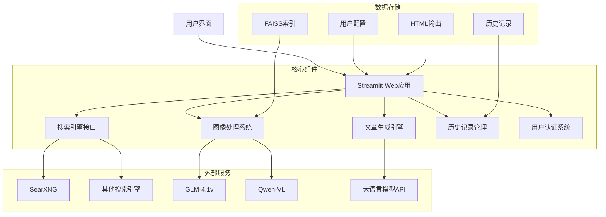

# 超级写手 (SupaWriter)

**超级写手** 是一个集成了大模型、搜索引擎和多模态技术的智能写作平台，旨在通过自动化手段提升内容创作效率和质量。它不仅是一个文本生成工具，更是一个涵盖资料收集、信息整理、内容创作和多平台发布的全流程创作系统。

## 📋 功能概述

### 核心功能

1. **智能内容创作**
   - 基于搜索引擎自动查询并整合互联网资料
   - 智能分析和提取关键信息，构建文章框架
   - 根据用户需求生成定制化高质量内容
   - 支持多种写作风格和内容类型
   - 自动生成文章概要，提供整体内容预览

2. **多模态内容处理**
   - 智能图像识别和处理，自动为文章匹配相关图片
   - 图像内容理解和描述，增强文章可视化效果
   - 用户和文章特定的FAISS索引，确保图片数据隔离和准确匹配
   - 支持直接使用图片URL，无需本地存储

3. **内容创作导航中心**
   - 集成多种搜索引擎：SearXNG、秘塔AI搜索、Google等
   - 连接主流内容发布平台：微信公众号、头条号、百家号等
   - 提供AI视频创作工具链接：即梦、剪映等视频创作平台
   - 本地Markdown编辑器和内容管理工具

4. **用户系统与历史记录**
   - 多用户支持，数据隔离
   - 创作历史记录和数据分析
   - 个性化设置和偏好保存
   - 统一的HTML预览和下载界面

## 🔧 技术特点

1. **高效并发网页抽取**
   - 基于Playwright的异步网页内容获取
   - 可配置的并发爬虫数量（默认30个）
   - 智能超时处理和错误重试机制
   - 批次内URL去重，避免重复内容

2. **智能图像处理系统**
   - 支持多种VL模型：GLM-4.1v和Qwen-VL系列
   - 图像URL规范化和去重处理
   - 基于FAISS的图像相似度检索
   - 支持直接图片URL嵌入或多模态处理

3. **用户和文章特定的数据隔离**
   - 每篇文章独立的FAISS索引
   - 基于用户名和文章ID的索引路径结构：`/data/faiss/{username}/{article_id}/`
   - 自动索引加载和回退机制
   - 多用户环境下的数据安全隔离

4. **可靠的错误处理**
   - 搜索结果为空的错误处理和提示
   - 网络请求超时保护
   - 详细的日志记录和状态追踪
   - 任务状态实时更新

## 💯 应用场景

1. **自媒体内容创作**
   - 快速生成高质量的平台文章
   - 多平台内容发布和管理
   - 图文结合的富媒体内容

2. **专业文档撰写**
   - 研究报告和行业分析
   - 技术文档和教程
   - 项目计划和商业提案

3. **教育内容开发**
   - 课程材料和教案
   - 学习指南和参考资料
   - 知识点总结和扩展阅读

4. **个人知识管理**
   - 信息收集和整理
   - 知识总结和归纳
   - 个人笔记和学习记录

## 💯 工作流程


## 📊 系统架构



## 🔨️ 系统要求

- Python 3.8+
- 支持异步操作的现代浏览器
- 互联网连接
- 大语言模型API密钥（支持多种提供商）
- 视觉语言模型API密钥（用于图像处理）

## ⚙️ 配置说明

### 主要配置文件

- **`.streamlit/secrets.toml`**: 配置必要的API密钥和访问凭证
  ```toml
  # 大语言模型配置
  [llm]
  provider = "openai"  # 可选: openai, wenxin, tongyi, xinference, jina
  api_key = "your_api_key"
  model = "gpt-4-turbo"
  
  # 视觉语言模型配置
  [vl_model]
  provider = "glm"  # 可选: glm, qwen
  api_key = "your_api_key"
  model = "glm-4-vision"
  ```

- **`settings.py`**: 系统全局设置
  ```python
  # 爬虫配置
  SPIDER_CONCURRENCY = 30  # 并发爬虫数量
  
  # 图像处理配置
  IMAGE_EMBEDDING_METHOD = "url"  # 可选: "url" 或 "multimodal"
  VL_MODEL_TYPE = "glm"  # 可选: "glm" 或 "qwen"
  
  # 嵌入服务配置
  EMBEDDING_SERVICE = "jina"  # 可选: "gitee", "xinference", "jina"
  ```

### 支持的模型和服务

- **大语言模型**: OpenAI, 文心一言, 通义千问, Xinference, Jina
- **视觉语言模型**: GLM-4.1v, Qwen-VL系列
- **搜索引擎**: SearXNG, 秘塔AI搜索, Google
- **嵌入服务**: Gitee, Xinference, Jina

## 💻 使用指南

### 快速开始

1. **安装依赖**
   ```bash
   pip install -r requirements.txt
   ```

2. **配置API密钥**
   - 创建`.streamlit/secrets.toml`文件
   - 根据上述配置说明添加必要的API密钥

3. **启动应用**
   ```bash
   streamlit run web.py
   ```

### 文章生成流程

1. 登录应用或使用匿名模式
2. 输入文章主题或关键词
3. 选择生成参数（模型、并发数量、是否启用图片等）
4. 点击生成按钮，等待文章生成
5. 在预览界面查看和编辑生成的文章
6. 导出为Markdown或HTML格式

## 👨‍💻 开发团队

超级写手由一个致力于AI辅助创作的团队开发，我们的目标是让内容创作变得更加高效、智能和有趣。

## 📦 未来规划

1. 支持更多内容平台的直接发布
2. 增强多模态内容处理能力
3. 提供更多自定义写作风格和模板
4. 开发API接口，支持第三方集成
5. 增加协作功能，支持团队创作

## 📓 贡献指南

欢迎对超级写手项目进行贡献！以下是参与开发的步骤：

1. Fork本仓库
2. 创建功能分支 (`git checkout -b feature/amazing-feature`)
3. 提交更改 (`git commit -m 'Add some amazing feature'`)
4. 推送分支 (`git push origin feature/amazing-feature`)
5. 创建 Pull Request

## 📃 许可证

本项目采用MIT许可证，详见LICENSE文件。

---